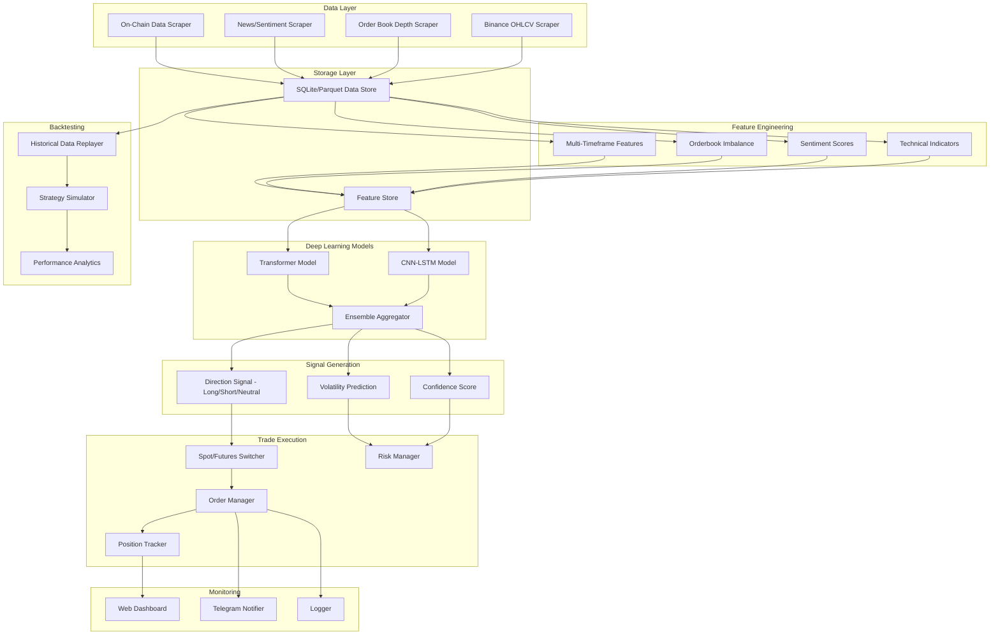
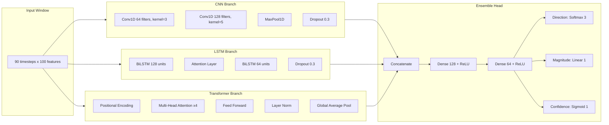
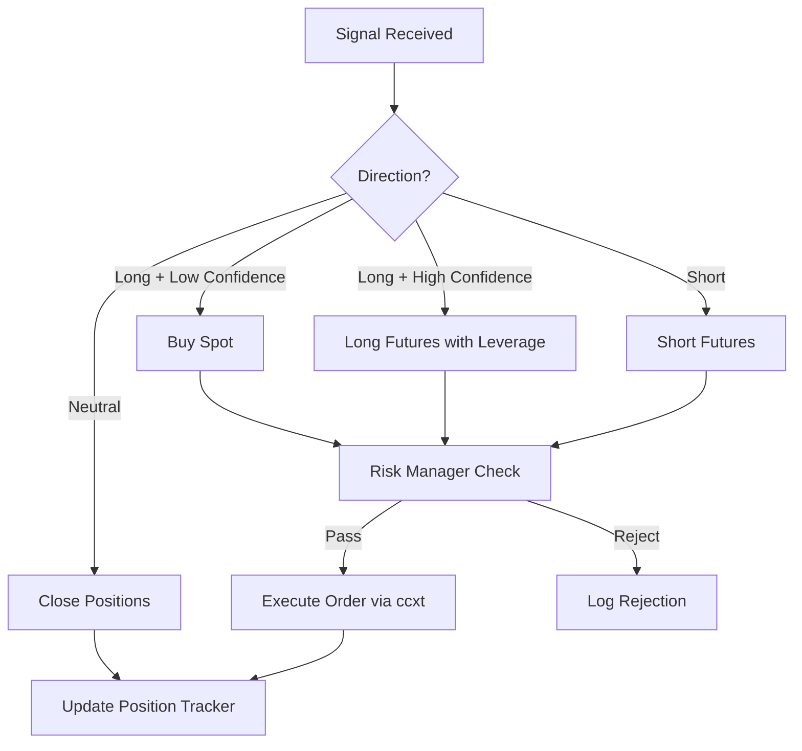
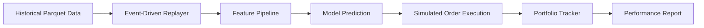
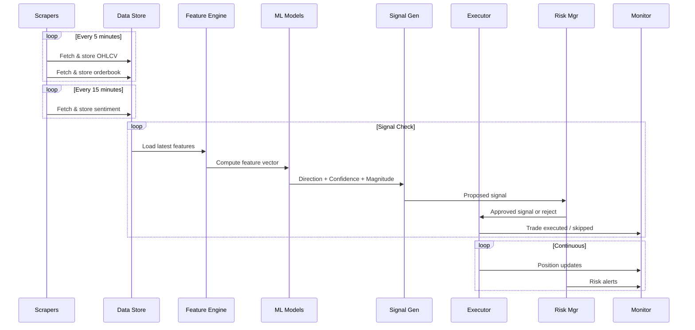

# Bot-CryptoV2: Deep Learning Swing Trading Bot — Architecture

## Overview

A modular, deep-learning-powered crypto swing trading bot that:
- Scrapes multi-source data (OHLCV, order book depth, news sentiment)
- Uses a hybrid CNN-LSTM + Transformer ensemble for signal generation
- Trades both **spot** and **futures** on Binance (switching based on signals)
- Includes a local backtesting engine that replays historical data
- Supports Binance testnet (demo.binance.com) for live paper trading validation

---

## High-Level Architecture Diagram



---

## Detailed Module Breakdown

### 1. Data Layer — Scraping & Collection

| Module | Description | Interval |
|--------|-------------|----------|
| `BinanceOHLCVScraper` | Fetches klines (5m, 15m, 1h, 4h, 1d) for top N pairs | 5m cron |
| `OrderBookScraper` | Fetches L2 order book depth snapshots | 1m |
| `SentimentScraper` | Scrapes crypto news (CoinTelegraph, CryptoPanic API), Reddit, Twitter/X | 15m |
| `OnChainScraper` | Whale alerts, exchange inflows/outflows via public APIs | 30m |

**Key decisions:**
- Use `ccxt` library for unified Binance API access (supports both spot and futures)
- Store raw data in **Parquet** files (efficient columnar storage for time-series)
- Sentiment data stored in **SQLite** (flexible schema for text + metadata)
- Rate limiting and retry logic built into each scraper

### 2. Storage Layer

```
bot-cryptov2/
├── data/
│   ├── raw/
│   │   ├── ohlcv/          # Parquet files per pair per timeframe
│   │   ├── orderbook/      # Parquet snapshots
│   │   └── sentiment/      # SQLite DB
│   └── features/
│       ├── technical/       # Pre-computed indicator features
│       ├── sentiment/       # Processed sentiment scores
│       └── combined/        # Final feature matrices
```

### 3. Feature Engineering

| Feature Category | Examples |
|-----------------|----------|
| **Price-based** | SMA, EMA, Bollinger Bands, ATR, VWAP |
| **Momentum** | RSI, MACD, Stochastic, CCI, Williams %R |
| **Volume** | OBV, MFI, Volume Profile, CVD |
| **Volatility** | ATR, Bollinger Band Width, Historical Vol |
| **Orderbook** | Bid/Ask imbalance, spread, depth pressure |
| **Sentiment** | News sentiment score, Fear/Greed index, social volume |
| **Multi-TF** | Features from 5m, 15m, 1h, 4h combined into single vector |
| **Derived** | Price rate of change, cross-pair correlation, BTC dominance |

**Feature vector per timestep:** ~80-120 features across all categories.

### 4. Deep Learning Models

#### Model Architecture: CNN-LSTM + Transformer Ensemble



**Why this architecture:**
- **CNN**: Captures local price patterns (candlestick-like patterns across features)
- **BiLSTM + Attention**: Captures longer-term temporal dependencies with focus on important timesteps
- **Transformer**: State-of-the-art attention mechanism for capturing complex relationships across the entire input window
- **Ensemble**: Combines all three for robust predictions, reducing individual model weakness

**Outputs (multi-task):**
1. **Direction**: 3-class softmax (Long / Short / Neutral)
2. **Magnitude**: Expected % price move in next N candles
3. **Confidence**: Model's confidence in its prediction

**Training:**
- Input: 90 timesteps × ~100 features (sliding window)
- Loss: Weighted combination of cross-entropy (direction) + MSE (magnitude) + BCE (confidence)
- Optimizer: AdamW with cosine annealing LR scheduler
- Regularization: Dropout, weight decay, early stopping

### 5. Signal Generation

```python
# Pseudocode
signal = model.predict(features)
direction = argmax(signal.direction)  # Long/Short/Neutral
confidence = signal.confidence
magnitude = signal.magnitude

# Thresholds
if confidence > 0.7 and magnitude > 0.5%:
    if direction == LONG:
        return BUY_SIGNAL
    elif direction == SHORT:
        return SELL_SIGNAL
return HOLD
```

**Spot vs Futures Decision Logic:**
- **Spot**: When direction is LONG only (no leverage)
- **Futures**: When direction is SHORT (need shorting capability), or LONG with leverage when confidence is very high (>0.85)
- Risk-adjusted: Higher confidence → higher leverage (capped at 3x)

### 6. Trade Execution



**Risk Manager Rules:**
- Max 5% of portfolio per trade
- Max 3 concurrent positions
- Stop-loss: 2% per position (trailing)
- Take-profit: Scaled exits at 3%, 5%, 8%
- Max daily drawdown: 5% → halt trading
- Max weekly drawdown: 10% → halt and alert

### 7. Backtesting Engine



**Backtesting features:**
- Event-driven simulation (not vectorized — more realistic)
- Slippage simulation (0.05% per trade)
- Commission simulation (Binance: 0.1% spot, 0.02% futures)
- Walk-forward validation (train on past, test on future)
- Monte Carlo simulation for robustness
- Sharpe ratio, max drawdown, win rate, profit factor metrics

### 8. Configuration & Orchestration

```yaml
# config.yaml
trading:
  mode: backtest  # backtest | testnet | live
  pairs: [BTC/USDT, ETH/USDT, SOL/USDT, ...]
  timeframes: [5m, 15m, 1h, 4h]
  
model:
  input_window: 90
  retrain_interval: 24h
  ensemble_weights: [0.35, 0.35, 0.30]  # CNN, LSTM, Transformer
  
risk:
  max_position_pct: 0.05
  max_concurrent: 3
  stop_loss_pct: 0.02
  take_profit_levels: [0.03, 0.05, 0.08]
  max_daily_drawdown: 0.05
  
exchange:
  testnet: true
  api_key: ${BINANCE_TESTNET_KEY}
  api_secret: ${BINANCE_TESTNET_SECRET}
```

---

## Project File Structure

```
bot-cryptov2/
├── config.yaml                  # Main configuration
├── main.py                      # Entry point — orchestrator
├── requirements.txt
├── .env.example
├── .gitignore
├── README.md
│
├── scrapers/                    # Data collection
│   ├── __init__.py
│   ├── base_scraper.py          # Abstract base with rate limiting/retry
│   ├── ohlcv_scraper.py         # Binance klines
│   ├── orderbook_scraper.py     # L2 depth
│   ├── sentiment_scraper.py     # News + social
│   └── onchain_scraper.py       # Whale/exchange flow data
│
├── features/                    # Feature engineering
│   ├── __init__.py
│   ├── technical.py             # TA indicators (TA-Lib / pandas_ta)
│   ├── sentiment_features.py    # Sentiment → numeric features
│   ├── orderbook_features.py    # Order book imbalance, spread
│   ├── multi_timeframe.py       # Cross-timeframe feature merging
│   └── pipeline.py              # Orchestrates all feature computation
│
├── models/                      # Deep learning models
│   ├── __init__.py
│   ├── cnn_lstm.py              # CNN-LSTM branch
│   ├── transformer.py           # Transformer branch
│   ├── ensemble.py              # Ensemble model combining branches
│   ├── trainer.py               # Training loop with callbacks
│   ├── predictor.py             # Inference wrapper
│   └── saved/                   # Saved model checkpoints
│       └── .gitkeep
│
├── signal/                      # Signal generation
│   ├── __init__.py
│   ├── generator.py             # Raw model output → trade signals
│   └── filters.py               # Additional signal filters
│
├── execution/                   # Trade execution
│   ├── __init__.py
│   ├── exchange.py              # ccxt wrapper for spot + futures
│   ├── order_manager.py         # Order lifecycle management
│   ├── position_tracker.py      # Open position tracking
│   ├── market_decider.py        # Spot vs futures switching logic
│   └── risk_manager.py          # Position sizing, stop-loss, drawdown
│
├── backtest/                    # Backtesting engine
│   ├── __init__.py
│   ├── replayer.py              # Historical data event-driven replayer
│   ├── simulator.py             # Simulated execution engine
│   ├── analytics.py             # Performance metrics & reporting
│   └── walk_forward.py          # Walk-forward validation
│
├── data/                        # Data storage
│   ├── raw/
│   │   ├── ohlcv/
│   │   ├── orderbook/
│   │   └── sentiment/
│   └── features/
│
├── storage/                     # Data access layer
│   ├── __init__.py
│   ├── parquet_store.py         # Read/write Parquet files
│   └── sqlite_store.py          # Read/write SQLite
│
├── monitoring/                  # Monitoring & alerts
│   ├── __init__.py
│   ├── dashboard.py             # Streamlit/Gradio web dashboard
│   ├── notifier.py              # Telegram notifications
│   └── logger.py                # Structured logging
│
└── tests/                       # Unit tests
    ├── test_scrapers.py
    ├── test_features.py
    ├── test_models.py
    ├── test_execution.py
    └── test_backtest.py
```

---

## Technology Stack

| Component | Technology | Reason |
|-----------|-----------|--------|
| Exchange API | `ccxt` | Unified API for 100+ exchanges, spot + futures |
| Data Storage | `Parquet` + `SQLite` | Columnar for time-series, flexible for text |
| Technical Analysis | `pandas_ta` | Comprehensive TA library |
| Deep Learning | `PyTorch` | Flexible, great for custom architectures |
| NLP/Sentiment | `transformers` (HuggingFace) | Pre-trained sentiment models |
| News API | `CryptoPanic` / scraping | Crypto-specific news aggregation |
| Backtesting | Custom event-driven | Full control over simulation |
| Dashboard | `Streamlit` | Quick interactive web UI |
| Notifications | `python-telegram-bot` | Real-time alerts |
| Orchestration | `APScheduler` | Cron-like scheduling for scrapers + signals |

---

## Data Flow (Runtime)



---

## Implementation Phases

See todo list for ordered implementation steps.
